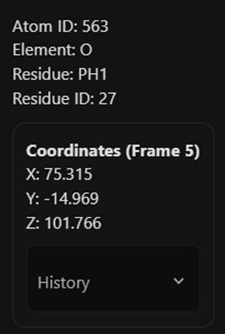
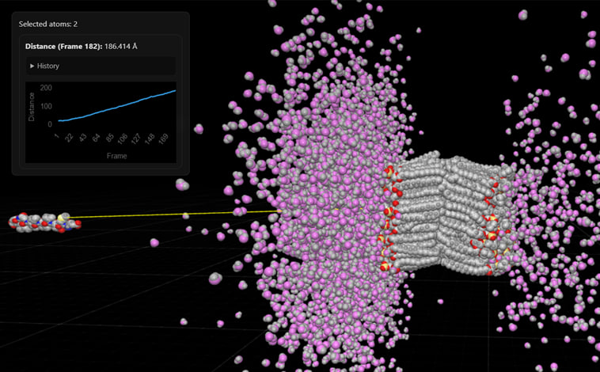
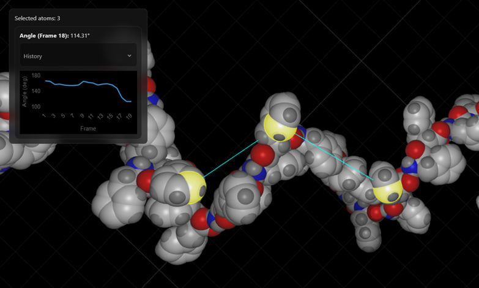
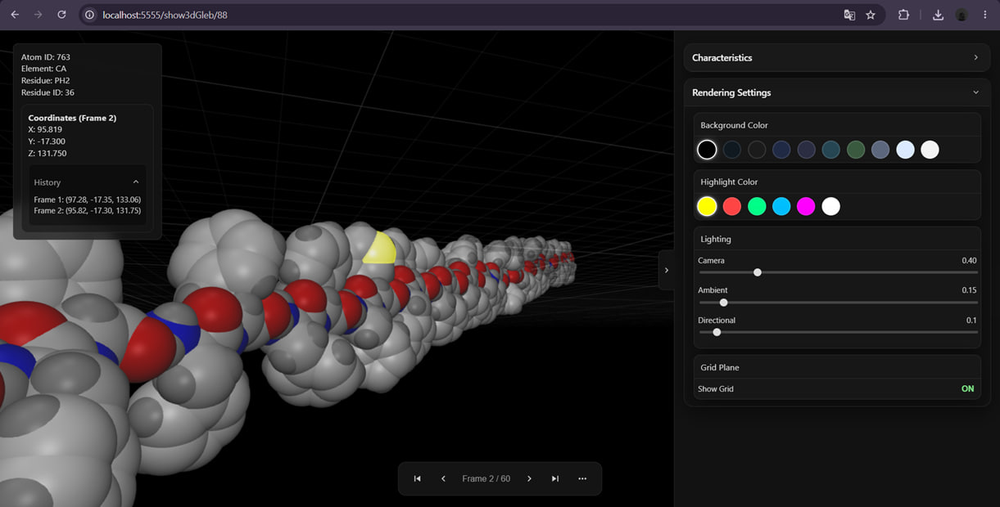
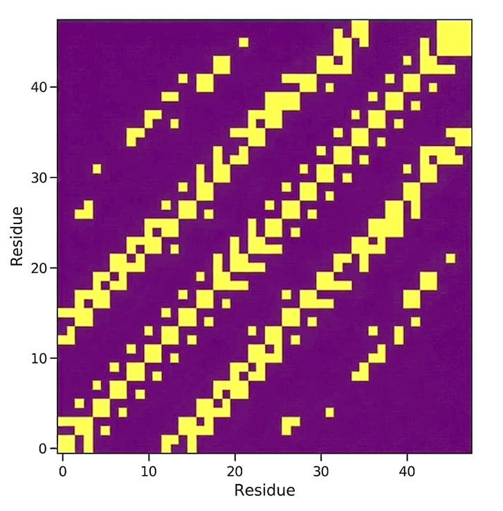
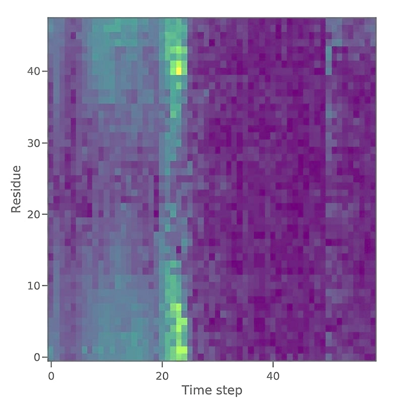
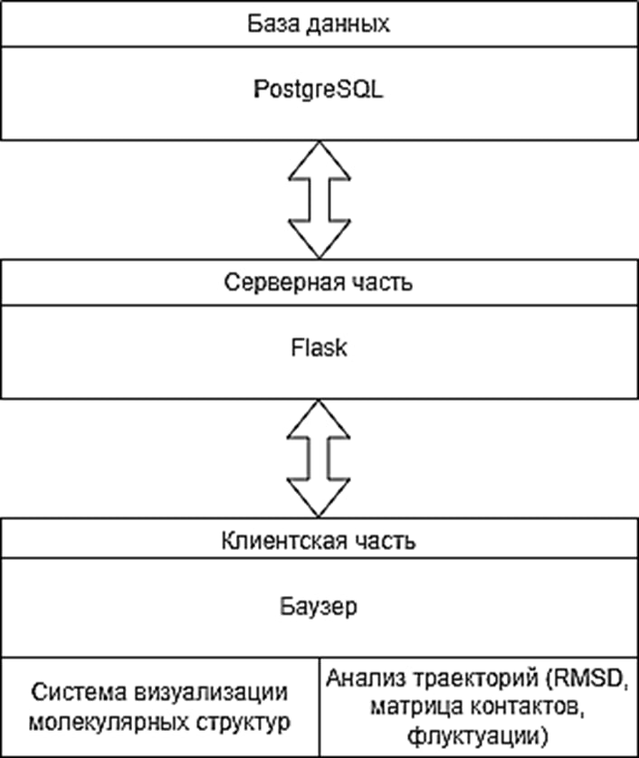
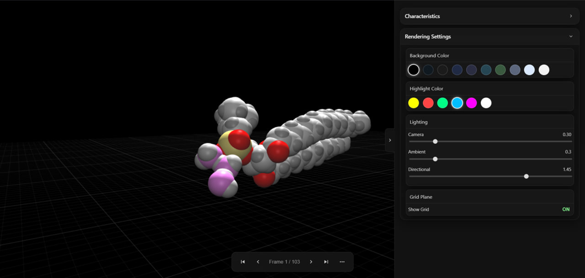

# Molecular Dynamics Analysis & Visualization

A software subsystem for analysis and visualization of molecular dynamics simulation data, developed for the **Pushchino State Genomic Research Institute (ПущГЕНИ)** as part of the **TAMD-Web** project.

## About the project

**TAMD-Web** is a web-based system for working with molecular dynamics trajectories and molecular structures.

The project provides tools for storing, processing, analyzing and visualizing molecular dynamics data.

The developed subsystem extends TAMD-Web with functionality for:

* three-dimensional visualization of molecular structures and trajectories;
* interactive interaction with molecular models;
* calculation of molecular characteristics;
* calculation and visualization of contact and fluctuation matrices;
* visualization of analysis results using graphs and heatmaps.

## My contribution

I developed several components of the TAMD-Web system, including the molecular dynamics visualization subsystem and computational modules for trajectory analysis.

### Molecular dynamics visualization

Developed a web-based 3D visualization subsystem for molecular structures and molecular dynamics trajectories.

Implemented:

* trajectory playback;
* frame-by-frame trajectory inspection;
* animation mode;
* interactive selection of atoms;
* display of information about selected atoms;
* distance measurement between atoms;
* angle measurement between atoms;
* interactive analysis directly within the 3D scene.

### Interactive molecular model

The visualization subsystem provides interactive tools for examining molecular structures.

#### Atom selection

Individual atoms can be selected directly in the 3D scene. Information about the selected atom is displayed in the interface, including its element, residue type and residue number.

#### Distance measurement

The distance between two selected atoms can be measured directly in the molecular model.

#### Angle measurement

The angle formed by three selected atoms can be measured directly in the 3D scene.

These tools allow structural characteristics to be investigated interactively without leaving the molecular visualization environment.

### Visualization settings

A dedicated control panel provides settings for the appearance and rendering of the molecular scene.

The available parameters include:

* background settings;
* lighting parameters;
* visualization parameters of molecular structures;
* other graphical rendering settings.

## Contact matrix

Implemented the calculation and visualization of molecular contact matrices.

The contact matrix represents spatial contacts between molecular elements and allows structural changes during a molecular dynamics simulation to be analyzed.

The calculated matrices are presented as heatmaps.

## Fluctuation matrix

Implemented the calculation and visualization of fluctuation matrices for analyzing the dynamic behavior of molecular systems.

The calculation is based on changes in atomic coordinates throughout the molecular dynamics trajectory.

The resulting data can be represented as a heatmap for further analysis.

## Additional analysis

The subsystem also includes:

* RMSD calculation;
* spatial structural alignment using the Kabsch algorithm;
* calculation of distances and angles along a trajectory;
* visualization of calculated characteristics using graphs and heatmaps.

## System architecture

The architecture of the developed subsystem and its integration with TAMD-Web are shown below.

## Rendering and performance optimization

A significant part of the work was dedicated to the development and optimization of the molecular dynamics renderer.

The original TAMD-Web renderer was replaced with a solution based on **Babylon.js and WebGL**.

The following optimizations were implemented:

* shared materials for atoms of the same type;
* reduction of the number of graphical objects created in the scene;
* reduction of GPU workload;
* increased geometric quality of spherical atom models;
* improved visual quality of molecular structures.

As a result, visualization performance was increased by **more than 2×**.

Performance testing was conducted on molecular systems containing up to **32,000 atoms**.

## Technology stack

**Backend**

* Python
* Flask
* NumPy

**Frontend**

* HTML
* CSS
* JavaScript

**3D visualization**

* Babylon.js
* WebGL

**Data visualization**

* Plotly
* Chart.js

**Database**

* PostgreSQL

## Analysis and visualization examples

The subsystem was demonstrated using several molecular dynamics experiments, including:

* peptide translocation through a cell membrane;
* self-assembly of a diphenylalanine nanotube;
* a phospholipid system with three water molecules.

### Molecular dynamics visualization

## Project materials

This repository contains selected screenshots, diagrams and visual examples demonstrating the functionality developed as part of the project.

The original production source code is not included because the software was developed as part of an institutional project.

## Project status

**Completed**

The described components were developed as part of the TAMD-Web project.

## Academic project

**Project:** Development of a subsystem for calculating fluctuation and contact matrices for TAMD-Web

**Institution:** Tula State University, Institute of Applied Mathematics and Computer Science

**Year:** 2026
